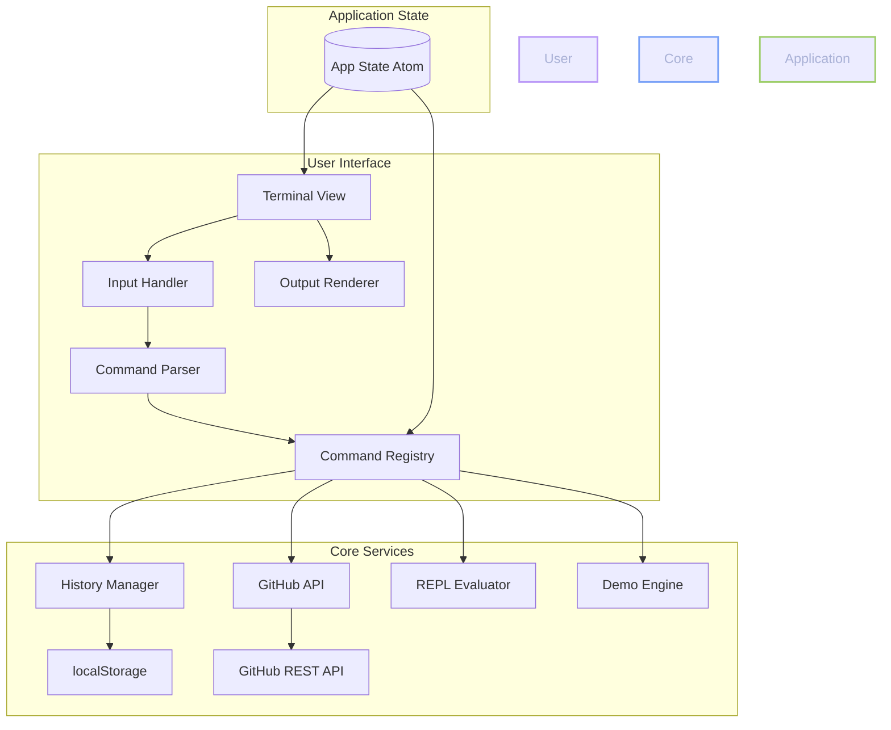

# The Sovereign Terminal

<div align="center">


**A production-grade terminal application built with ClojureScript, featuring enterprise GitHub integration and a sophisticated REPL environment.**

[Features](#-features) • [Architecture](#-architecture) • [Quick Start](#-quick-start) • [Deployment](#-deployment)

</div>

---

## 🎯 Features

| Feature | Description |
|---------|-------------|
| **Terminal Emulation** | Full-featured terminal with command input/output, history navigation, and persistent session state |
| **GitHub Integration** | Enterprise-grade GitHub API integration with token-based authentication for repo search and user management |
| **REPL Environment** | Sophisticated ClojureScript REPL supporting arithmetic, logic operations, and extensible command registration |
| **Command History** | Persistent command history using localStorage with search and retrieval capabilities |
| **Interactive Demos** | Built-in demo system showcasing terminal capabilities with extensible demo framework |
| **Theming Engine** | Professional theming system with Tokyo Night (dark) and light themes, CSS custom properties |
| **CI/CD Pipeline** | Production-ready GitHub Actions workflow with automated builds and Fly.io deployments |
| **Type Safety** | End-to-end type safety with Clojure's immutable data structures and reagent's reactive model |

---

## 🏗️ Architecture



### Component Overview

```
┌─────────────────────────────────────────────────────────────────────────┐
│                         The Sovereign Terminal                            │
├─────────────────────────────────────────────────────────────────────────┤
│  ┌─────────────┐    ┌─────────────┐    ┌─────────────┐    ┌──────────┐ │
│  │   Terminal  │    │   History   │    │    REPL     │    │  GitHub  │ │
│  │   UI/View   │    │   Manager   │    │  Evaluator  │    │  Client  │ │
│  └─────────────┘    └─────────────┘    └─────────────┘    └──────────┘ │
│         │                  │                  │                 │        │
│         └──────────────────┼──────────────────┼─────────────────┘        │
│                            │                  │                          │
│                     ┌──────▼──────┐   ┌──────▼──────┐                   │
│                     │   Command    │   │  Application│                   │
│                     │  Registry    │   │   State     │                   │
│                     └─────────────┘   └─────────────┘                   │
├─────────────────────────────────────────────────────────────────────────┤
│                           Infrastructure                                │
│  ┌─────────────┐    ┌─────────────┐    ┌─────────────┐                 │
│  │   Reagent   │    │  Shadow-cljs │    │  Fly.io     │                 │
│  │   React     │    │   Compiler   │    │  Deploy     │                 │
│  └─────────────┘    └─────────────┘    └─────────────┘                 │
└─────────────────────────────────────────────────────────────────────────┘
```

---

## 🚀 Quick Start

### Prerequisites

| Tool | Version | Purpose |
|------|---------|---------|
| [Clojure CLI](https://clojure.org/guides/getting_started) | ≥ 1.11.0 | Primary build tool |
| [Node.js](https://nodejs.org/) | ≥ 18 | JavaScript runtime |
| [npm](https://www.npmjs.com/) | ≥ 9 | Package manager |

### Installation

```bash
# Clone the repository
git clone https://github.com/dennisgathu8/svterminal1.git
cd svterminal1

# Install dependencies
npm install

# Start development server
npm run dev

# Open in browser
# http://localhost:8080
```

### Production Build

```bash
# Build optimized assets
npm run build

# Output location: resources/public/js/compiled/
```

---

## 📖 Usage

### Built-in Commands

```bash
# Display help information
help

# Clear terminal output
clear

# Echo text to terminal
echo "Hello, World!"

# Print working directory
pwd

# List directory contents
ls

# Display current timestamp
date

# GitHub integration
github set-token <token>
github user
github search <query>

# Run demos
demo hello
demo math
demo colors
demo clock
```

### REPL Operations

```clojure
(+ 1 2)    ;; => 3
(- 10 4)   ;; => 6
(* 5 6)    ;; => 30
(quot 100 4) ;; => 25
```

---

## 🧩 Extensibility

### Register Custom Commands

```clojure
(ns my-commands
  (:require [sovereign-terminal.repl.core :as repl]))

(repl/register-command! 
  "my-command" 
  (fn [state args]
    (swap! state update :output conj "Custom command executed!")
    nil))
```

### Add New Demos

```clojure
(ns my-demos
  (:require [sovereign-terminal.demos.core :as demos]))

(demos/register-demo!
  "my-demo"
  "Description of my demo"
  (fn [state]
    (swap! state update :output conj "Demo output")
    nil))
```

---

## 📦 Project Structure

```
svterminal1/
├── .github/workflows/
│   └── deploy.yml           # CI/CD pipeline
├── dev/
│   └── preload.cljs          # Development reload support
├── resources/public/
│   ├── css/
│   │   └── style.css        # Tokyo Night theme
│   ├── favicon.svg
│   └── index.html           # Entry point
├── src/sovereign_terminal/
│   ├── core.cljs            # Application bootstrap
│   ├── demos/
│   │   └── core.cljs        # Demo framework
│   ├── github/
│   │   └── core.cljs        # GitHub API client
│   ├── history/
│   │   └── core.cljs        # Persistence layer
│   ├── repl/
│   │   ├── core.cljs        # Command executor
│   │   └── eval.cljs        # Expression evaluator
│   └── ui/
│       ├── components.cljs  # Reusable components
│       └── terminal.cljs    # Terminal interface
├── deps.edn                 # Clojure dependencies
├── fly.toml                # Fly.io config
├── package.json            # Node dependencies
└── shadow-cljs.edn         # Build configuration
```

---

## 🚁 Deployment

### Fly.io

```bash
# Authenticate
flyctl auth login

# Launch
flyctl launch

# Deploy
flyctl deploy
```

### CI/CD Pipeline

The repository includes a production-ready GitHub Actions workflow:

1. **Build Job**: Compiles ClojureScript → JavaScript
2. **Deploy Job**: Deploys to Fly.io on main branch commits

**Required Secrets:**
- `FLY_API_TOKEN` - Fly.io authentication token

---

## 🛠️ Development

### Running Tests

```bash
npm test
```

### Hot Reload

```bash
npm run dev
```

The development server provides:
- Instant hot reload on file changes
- REPL integration via shadow-cljs
- Source map support for debugging

---

## 📄 License

MIT License - see [LICENSE](LICENSE) for details.

---

## 🤝 Contributing

1. Fork the repository
2. Create a feature branch (`git checkout -b feature/amazing-feature`)
3. Commit changes (`git commit -m 'feat: add amazing feature'`)
4. Push to branch (`git push origin feature/amazing-feature`)
5. Open a Pull Request

---

<div align="center">

**Built with ❤️ using ClojureScript, Reagent, and Shadow-cljs**

</div>
